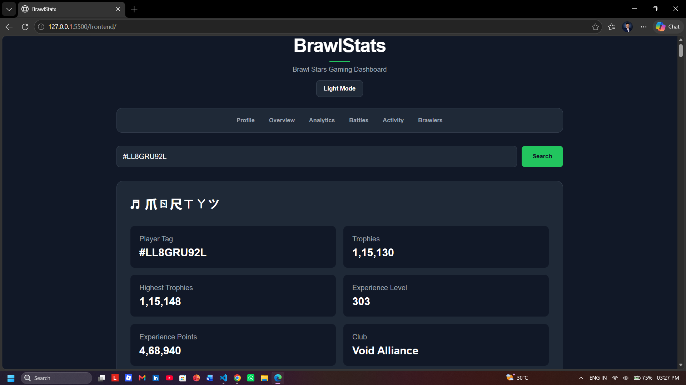
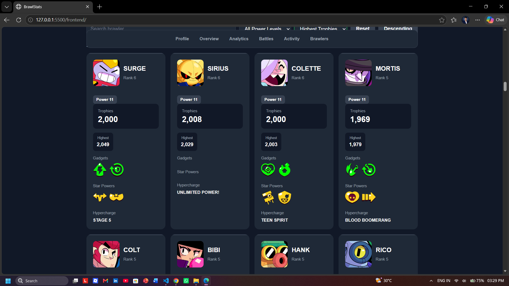
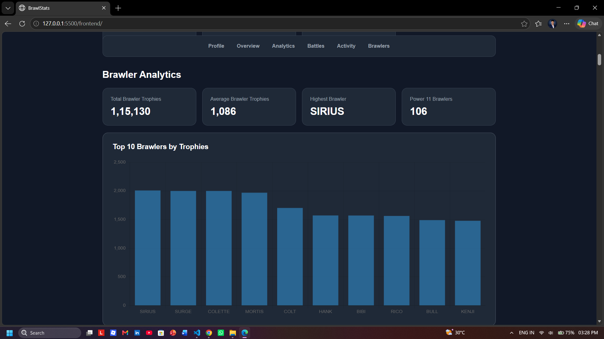
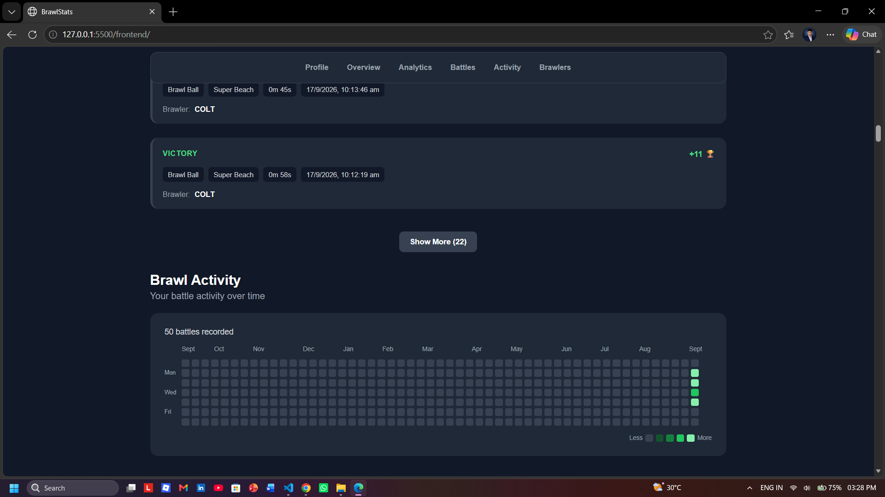

# BrawlStats

A Brawl Stars Gaming Stats Dashboard built with HTML, CSS, JavaScript, Node.js and Express.

## Features

- Player profile and statistics
- Player trophy statistics
- Brawler collection
- Brawler search
- Brawler filtering and sorting
- Brawler analytics
- Top brawlers chart
- Power level distribution
- Trophy distribution
- Recent battle log
- Battle statistics and win rate
- Brawl Activity heatmap
- Dark/Light mode
- Responsive dashboard

## Screenshots

### Player Dashboard



### Brawler Collection



### Brawler Analytics



### Recent Battles



## Tech Stack

- HTML5
- CSS3
- JavaScript
- Node.js
- Express.js
- Axios
- Brawl Stars API
- Chart.js
- LocalStorage

## Project Structure

```text
BrawlStats/
├── backend/
│   ├── routes/
│   │   ├── player.js
│   │   └── battlelog.js
│   ├
│   ├── package.json
│   └── server.js
│
├── frontend/
│   ├── css/
│   │   └── style.css
│   ├── js/
│   │   └── app.js
│   └── index.html
│
├── screenshots/
│   ├── dashboard.png
│   ├── brawlers.png
│   ├── analytics.png
│   └── battles.png
│
└── README.md

## About

BrawlStats is a personal web project created to explore API integration, frontend development, data visualization and backend development using Node.js and Express.

## Author

**Yash Funde**